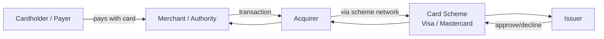
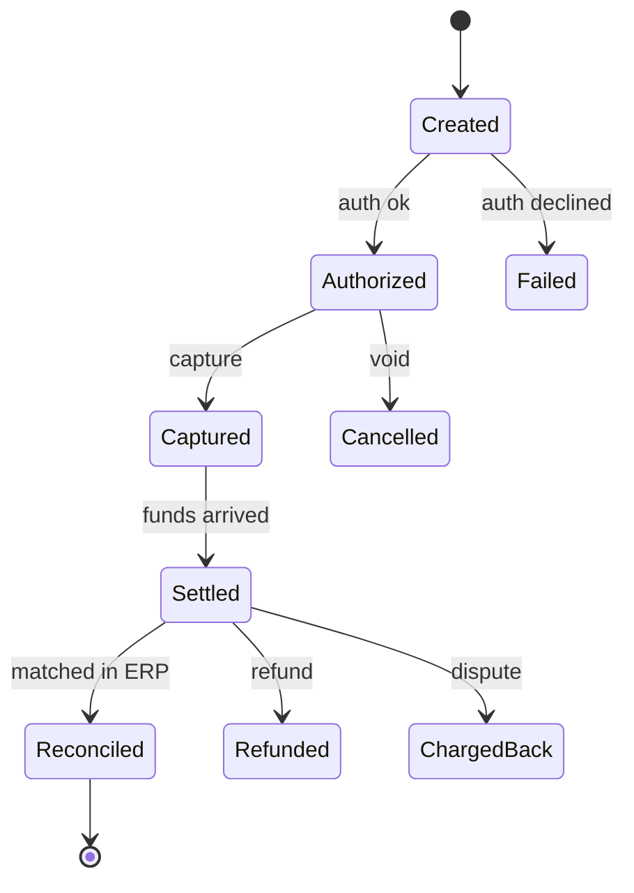
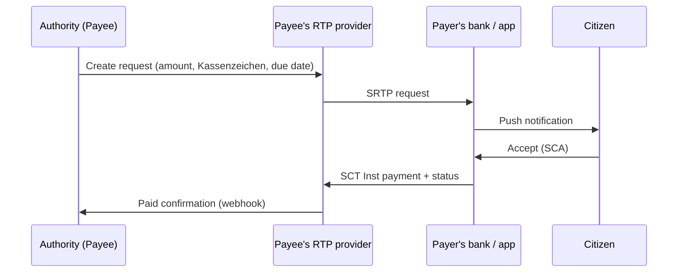
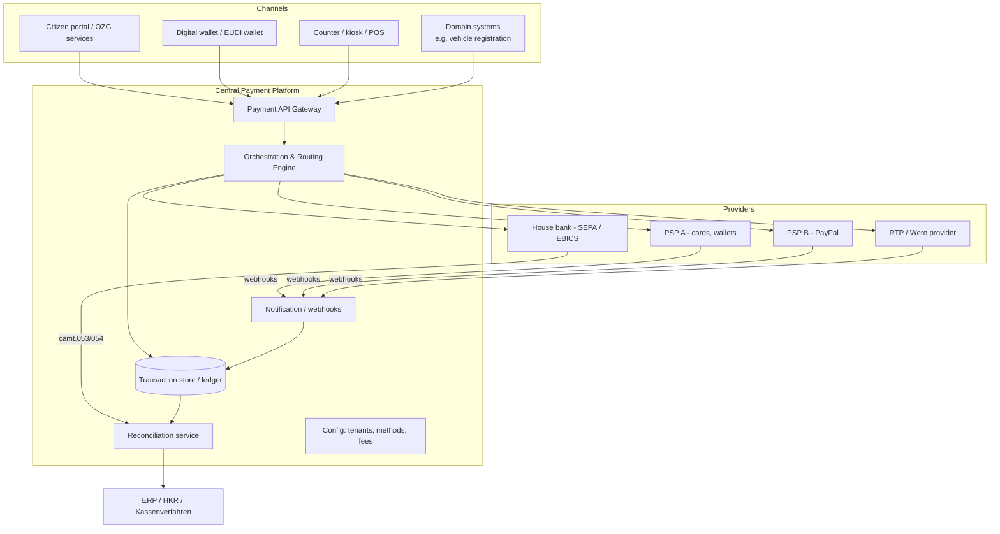
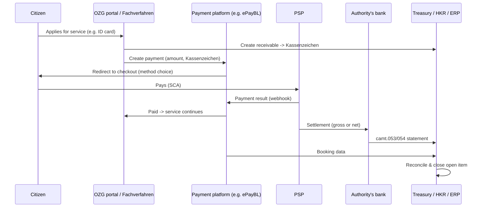

# Payment Solutions Consultant — Study Guide (English + فارسی)

> Target role: **Senior Consultant, Payment Solutions (Public Sector, Germany)**
> Level: fundamentals → middle. Each section is taught in **English** first, then in **Persian (فارسی)**.
> Status of regulations reflects what is known as of late 2026 — always double-check the latest dates before an interview.

---

## Table of Contents

1. [The Payments Ecosystem — Who Is Who](#1-the-payments-ecosystem--who-is-who)
2. [Payment Lifecycle: Authorization, Clearing, Settlement, Reconciliation](#2-payment-lifecycle-authorization-clearing-settlement-reconciliation)
3. [Payment Methods: SEPA, Instant, Cards, Wallets](#3-payment-methods-sepa-instant-cards-wallets)
4. [Modern Methods: Request-to-Pay, Wero, Digital Euro, Agentic Payments](#4-modern-methods-request-to-pay-wero-digital-euro-agentic-payments)
5. [Standards & Messages: IBAN, ISO 20022, EBICS](#5-standards--messages-iban-iso-20022-ebics)
6. [Payment Architecture: PSP Integration, Orchestration, Routing](#6-payment-architecture-psp-integration-orchestration-routing)
7. [API Design for Payments](#7-api-design-for-payments)
8. [Regulation: PSD2, ZAG, DORA, GDPR, PCI DSS, AML](#8-regulation-psd2-zag-dora-gdpr-pci-dss-aml)
9. [Public Sector Payments in Germany (ePayBL, OZG, Kassenzeichen)](#9-public-sector-payments-in-germany-epaybl-ozg-kassenzeichen)
10. [ERP, Digital Identity, Cloud & Platforms](#10-erp-digital-identity-cloud--platforms)
11. [Consulting Skills: Stakeholders, Requirements, Pilots, Rollout](#11-consulting-skills-stakeholders-requirements-pilots-rollout)
12. [German Glossary (Fachbegriffe)](#12-german-glossary-fachbegriffe)
13. [Interview Questions with Model Answers](#13-interview-questions-with-model-answers)
14. [Study Plan](#14-study-plan)

---

## 1. The Payments Ecosystem — Who Is Who

### English

Every payment involves a **payer** (the one who pays) and a **payee** (the one who receives). Between them sit several intermediaries:

| Actor | Role | Example |
|---|---|---|
| **Payer / Debtor** | Sends money | A citizen paying a parking fine |
| **Payee / Creditor / Merchant** | Receives money | A city administration (Stadtkasse) |
| **Issuer** | Bank that issues the payer's card / holds the payer's account | Sparkasse, ING |
| **Acquirer** | Bank/institution that accepts card payments on behalf of the merchant | Worldline, Nexi, Adyen |
| **Card Scheme** | Sets rules and runs the network | Visa, Mastercard, girocard |
| **PSP (Payment Service Provider)** | Technical + often commercial gateway that lets a merchant accept many methods through one integration | Stripe, Adyen, Computop, Mollie, PayPal |
| **CSM (Clearing & Settlement Mechanism)** | Infrastructure that exchanges and settles bank transfers | EBA STEP2, RT1, TIPS (ECB), Bundesbank |
| **TPP (Third-Party Provider)** | Licensed under PSD2 to access bank accounts via APIs | AISP / PISP like Tink, finAPI |

**The four-party model (cards):**



**Account-to-account (A2A) model (SEPA transfers):** payer's bank → CSM → payee's bank. No card scheme in the middle, which usually makes it cheaper — very attractive for the public sector.

**Key insight for the role:** a public authority is a *merchant* (payee). It normally does **not** want to become a regulated payment institution itself; it uses a PSP or a central platform (e.g., ePayBL) and a house bank.

### فارسی

<div dir="rtl">

در هر پرداخت یک **پرداخت‌کننده (Payer)** و یک **دریافت‌کننده (Payee)** وجود دارد. بین این دو، چند واسطه حضور دارند:

- **صادرکننده (Issuer):** بانکی که کارت یا حساب پرداخت‌کننده را صادر کرده است.
- **پذیرنده (Acquirer):** مؤسسه‌ای که از طرف فروشنده (Merchant) پرداخت کارتی را می‌پذیرد.
- **شبکه کارت (Card Scheme):** مثل Visa، Mastercard یا girocard آلمان؛ قوانین را تعیین می‌کند و شبکه را اداره می‌کند.
- **ارائه‌دهنده خدمات پرداخت (PSP):** درگاهی که به فروشنده اجازه می‌دهد با **یک اتصال** چندین روش پرداخت را بپذیرد (مثل Stripe، Adyen، Computop).
- **سامانه تسویه و پایاپای (CSM):** زیرساختی که انتقال‌های بانکی را مبادله و تسویه می‌کند (مثل RT1، TIPS، STEP2).
- **ارائه‌دهنده ثالث (TPP):** شرکت‌هایی که طبق PSD2 مجوز دارند از طریق API به حساب بانکی دسترسی داشته باشند.

**مدل چهارطرفه کارت:** دارنده کارت ← فروشنده ← پذیرنده ← شبکه کارت ← صادرکننده.

**مدل حساب‌به‌حساب (A2A):** بانک پرداخت‌کننده ← سامانه تسویه ← بانک دریافت‌کننده. چون شبکه کارت در میان نیست، معمولاً **ارزان‌تر** است و برای بخش دولتی بسیار جذاب است.

**نکته کلیدی برای این شغل:** نهاد دولتی نقش «فروشنده/دریافت‌کننده» را دارد و معمولاً **نمی‌خواهد** خودش مؤسسه پرداخت تحت نظارت شود؛ بنابراین از یک PSP یا پلتفرم مرکزی (مثل ePayBL) و یک بانک طرف قرارداد استفاده می‌کند.

</div>

---

## 2. Payment Lifecycle: Authorization, Clearing, Settlement, Reconciliation

### English

A payment is not one event; it is a **process**:

1. **Initiation** — the payer starts the payment (checkout, QR code, mandate, request).
2. **Authentication** — prove the payer is who they claim (PSD2 *Strong Customer Authentication*, 3-D Secure for cards).
3. **Authorization** — issuer/bank checks funds, limits, fraud, and approves or declines. For cards the money is *reserved*, not yet moved.
4. **Capture** — merchant confirms it wants the reserved money (immediately or later, e.g., after delivery).
5. **Clearing** — exchange of transaction information between institutions; calculation of who owes whom.
6. **Settlement** — actual movement of central-bank or commercial-bank money. Cards: usually T+1/T+2. SEPA Credit Transfer: same/next day. Instant: within 10 seconds.
7. **Payout** — PSP transfers net funds (minus fees) to the merchant's account.
8. **Reconciliation** — matching incoming money to open receivables (in the public sector: matching to the *Kassenzeichen* / invoice). This is often the **most painful part** in practice.
9. **Exceptions** — refunds, chargebacks (card disputes), returns/R-transactions (SEPA: reject, return, refund, recall).



**Push vs Pull payments**
- **Push:** payer's side sends money (credit transfer, instant payment). Final once settled; no chargeback.
- **Pull:** payee's side collects money (direct debit, card). Payer has protection (SDD refund up to 8 weeks, card chargeback).

**Gross vs net settlement:** PSPs often settle *net* (amount minus fees). Public authorities frequently require *gross* settlement because budget law demands that revenues and fees are booked separately (*Bruttoprinzip* in German budget law). This is a real requirement you will meet.

### فارسی

<div dir="rtl">

پرداخت یک رویداد واحد نیست، بلکه یک **فرایند** است:

1. **آغاز (Initiation):** پرداخت‌کننده پرداخت را شروع می‌کند.
2. **احراز هویت (Authentication):** اثبات اینکه پرداخت‌کننده همان کسی است که ادعا می‌کند (SCA در PSD2 و 3-D Secure برای کارت).
3. **مجوز (Authorization):** بانک موجودی و ریسک تقلب را بررسی و تأیید یا رد می‌کند. در کارت، پول فقط **رزرو** می‌شود.
4. **برداشت (Capture):** فروشنده تأیید می‌کند که پول رزروشده را می‌خواهد.
5. **پایاپای (Clearing):** تبادل اطلاعات تراکنش و محاسبه بدهی و طلب بین مؤسسات.
6. **تسویه (Settlement):** جابه‌جایی واقعی پول. کارت معمولاً یک تا دو روز، انتقال SEPA همان روز یا روز بعد، و پرداخت آنی (Instant) زیر ۱۰ ثانیه.
7. **واریز (Payout):** PSP مبلغ خالص را به حساب فروشنده واریز می‌کند.
8. **تطبیق (Reconciliation):** تطبیق پول دریافتی با مطالبات باز؛ در بخش دولتی یعنی تطبیق با **Kassenzeichen** (شناسه پرداخت). در عمل، این **دردسرسازترین** بخش است.
9. **استثناها:** بازپرداخت (Refund)، اعتراض کارتی (Chargeback) و برگشت تراکنش‌های SEPA (R-Transactions).

**پرداخت Push در برابر Pull:**
- **Push:** طرف پرداخت‌کننده پول را می‌فرستد (حواله، پرداخت آنی). پس از تسویه، قطعی است.
- **Pull:** دریافت‌کننده پول را برداشت می‌کند (برداشت مستقیم، کارت). پرداخت‌کننده حمایت دارد (مثلاً بازگشت وجه تا ۸ هفته در SEPA Direct Debit).

**تسویه ناخالص و خالص:** PSPها معمولاً **خالص** (مبلغ منهای کارمزد) واریز می‌کنند، اما قانون بودجه آلمان (اصل ناخالص یا Bruttoprinzip) اغلب ایجاب می‌کند که درآمد و کارمزد **جداگانه** ثبت شوند. این یک نیاز واقعی در پروژه‌های دولتی است.

</div>

---

## 3. Payment Methods: SEPA, Instant, Cards, Wallets

### English

**SEPA (Single Euro Payments Area)** — 36 countries, one set of euro payment schemes run by the **EPC** (European Payments Council).

| Scheme | Type | Key facts |
|---|---|---|
| **SCT** – SEPA Credit Transfer (*Überweisung*) | Push | Max 1 business day. Cheap. Needs good remittance info to reconcile. |
| **SCT Inst** – Instant Credit Transfer (*Echtzeitüberweisung*) | Push | 24/7/365, funds available in ≤10 s. Irrevocable. |
| **SDD Core** – Direct Debit (*Lastschrift*) | Pull | Needs a **mandate** + **Creditor Identifier** (*Gläubiger-ID*). Payer can request refund within 8 weeks (13 months if unauthorized). Good for recurring fees (e.g., taxes, kindergarten fees). |
| **SDD B2B** | Pull | Business only, no 8-week refund right. |

**EU Instant Payments Regulation (IPR, Reg. (EU) 2024/886):** euro-area PSPs had to *receive* instant payments by Jan 2025 and *send* them by Oct 2025, at a price **no higher** than a normal transfer, and offer **Verification of Payee (VoP)** — checking that the IBAN matches the payee's name — from Oct 2025. Impact: instant becomes the new normal; public authorities can get real-time confirmation of payments.

**Cards**
- Debit (girocard — Germany's domestic debit scheme; Visa/Mastercard Debit), Credit, Prepaid.
- **3-D Secure 2** = card implementation of SCA.
- **Interchange fees** are capped in the EU (0.2 % debit / 0.3 % credit for consumer cards — IFR).
- **PCI DSS** applies to anyone storing/processing/transmitting card data → use hosted payment pages / tokenization to reduce scope.

**Wallets**
- **Pass-through wallets:** Apple Pay, Google Pay — store a *tokenized* card (network token, DPAN); payment still runs over card rails. Biometrics satisfy SCA.
- **Staged / account wallets:** PayPal — own balance and account.
- **A2A wallets:** Wero (see section 4).
- **Tokenization:** the real card number (PAN) is replaced by a token, reducing fraud and PCI scope.

**Other German/European methods:** giropay/paydirekt was **shut down in 2024**; Wero is positioned as the successor. "Pay by Bank" / open-banking payment initiation (PISP) is another A2A option.

**How to choose methods for a public authority?** Consider: citizen reach (Germans love SEPA and PayPal; cards less than elsewhere), cost per transaction, finality (no chargeback), accessibility, reconciliation quality, and legal requirement to offer at least one electronic method (see section 9).

### فارسی

<div dir="rtl">

**SEPA (منطقه واحد پرداخت یورو):** ۳۶ کشور با طرح‌های پرداخت مشترک یورو که توسط **EPC** (شورای پرداخت اروپا) تعریف می‌شود.

- **SCT (حواله SEPA – Überweisung):** پرداخت Push، حداکثر یک روز کاری، ارزان.
- **SCT Inst (حواله آنی – Echtzeitüberweisung):** ۲۴ ساعته در تمام روزهای سال، پول در کمتر از ۱۰ ثانیه می‌رسد و **غیرقابل برگشت** است.
- **SDD Core (برداشت مستقیم – Lastschrift):** پرداخت Pull؛ نیاز به **مجوز برداشت (Mandate)** و **شناسه طلبکار (Gläubiger-ID)** دارد. پرداخت‌کننده تا ۸ هفته حق بازگشت وجه دارد. برای پرداخت‌های تکراری (مالیات، شهریه مهدکودک) مناسب است.
- **SDD B2B:** فقط برای کسب‌وکارها و بدون حق بازگشت ۸ هفته‌ای.

**مقررات پرداخت آنی اتحادیه اروپا (IPR):** بانک‌های منطقه یورو باید از ژانویه ۲۰۲۵ پرداخت آنی را **دریافت** و از اکتبر ۲۰۲۵ **ارسال** کنند، با قیمتی **نه بیشتر** از حواله عادی. همچنین **تأیید ذی‌نفع (VoP)** — بررسی تطابق IBAN با نام دریافت‌کننده — اجباری شد. نتیجه: پرداخت آنی به استاندارد جدید تبدیل می‌شود.

**کارت‌ها:**
- کارت نقدی (girocard، که شبکه داخلی آلمان است)، کارت اعتباری و پیش‌پرداخت.
- **3-D Secure 2** پیاده‌سازی SCA در کارت است.
- کارمزد بین‌بانکی (Interchange) در اتحادیه اروپا سقف دارد: ۰٫۲٪ برای نقدی و ۰٫۳٪ برای اعتباری.
- **PCI DSS:** هر کسی که داده کارت را ذخیره، پردازش یا منتقل کند مشمول آن است؛ با صفحه پرداخت میزبانی‌شده (Hosted Page) و **توکن‌سازی** دامنه آن را کاهش دهید.

**کیف پول‌ها (Wallets):**
- **Apple Pay / Google Pay:** کارت را به‌صورت **توکن** نگه می‌دارند؛ پرداخت همچنان روی شبکه کارت انجام می‌شود. بیومتریک، شرط SCA را برآورده می‌کند.
- **PayPal:** حساب و موجودی مستقل دارد.
- **Wero:** کیف پول حساب‌به‌حساب اروپایی (بخش ۴).
- **توکن‌سازی:** شماره واقعی کارت (PAN) با یک توکن جایگزین می‌شود.

**نکته:** giropay/paydirekt در سال ۲۰۲۴ **تعطیل شد** و Wero جانشین آن معرفی شده است.

**انتخاب روش پرداخت برای نهاد دولتی:** دسترسی شهروندان (آلمانی‌ها SEPA و PayPal را ترجیح می‌دهند)، هزینه هر تراکنش، قطعیت (عدم امکان Chargeback)، دسترس‌پذیری، کیفیت تطبیق و الزام قانونی ارائه حداقل یک روش الکترونیکی.

</div>

---

## 4. Modern Methods: Request-to-Pay, Wero, Digital Euro, Agentic Payments

### English

**Request-to-Pay (RTP / SRTP)**
- Not a payment method itself — a **messaging layer**. The payee sends a *request* to the payer; the payer accepts, and a payment (usually SCT Inst) is triggered automatically with all reference data pre-filled.
- EPC scheme: **SEPA Request-to-Pay (SRTP)**.
- Public-sector value: an authority sends a fee notice (*Gebührenbescheid*) as an RTP → citizen approves in banking app → instant payment with correct *Kassenzeichen* → **perfect reconciliation**, no typos.



**Wero (European Payments Initiative – EPI)**
- A European wallet launched 2024 by a consortium of European banks (including German Sparkassen and Volksbanken). Built on **SCT Inst** — so payments are instant and A2A.
- Started with P2P (pay friends via phone number), expanding to e-commerce and point-of-sale (2025–2026), replacing giropay/paydirekt and national solutions like iDEAL over time.
- Why it matters: **European sovereignty** (less dependence on non-EU card schemes), lower costs, instant finality.

**Digital Euro**
- A **central bank digital currency (CBDC)** for retail use, issued by the ECB/Eurosystem; would be legal tender.
- Key design features discussed: holding limits (e.g., around €3,000 per person discussed), offline payments, high privacy, distribution via banks/PSPs, free basic use for citizens, compensation model for merchants.
- Status: ECB finished its preparation phase in Oct 2025 and continues technical preparation; issuance depends on EU legislation (Regulation on the establishment of the digital euro) — earliest first issuance discussed around **2029**. Check the latest status before interviews.
- Public sector relevance: authorities may have to *accept* the digital euro (legal tender rules), so payment platforms must be ready to add it as another method through orchestration.

**Agentic Payments**
- Payments initiated by **AI agents** acting on behalf of a user (e.g., "book and pay my residence permit appointment fee").
- Challenges: delegated authority, consent, SCA for a non-human actor, liability, fraud.
- Industry initiatives: Visa Intelligent Commerce, Mastercard Agent Pay (agentic tokens), Google's Agent Payments Protocol (AP2), Stripe/OpenAI agentic commerce protocols.
- Architectural idea: agents get **scoped, tokenized credentials** with limits (amount, merchant, time) and a verifiable mandate from the user.

### فارسی

<div dir="rtl">

**درخواست پرداخت (Request-to-Pay):**
- خودش روش پرداخت نیست؛ یک **لایه پیام‌رسانی** است. دریافت‌کننده یک *درخواست* می‌فرستد، پرداخت‌کننده تأیید می‌کند و پرداخت (معمولاً آنی) با تمام اطلاعات مرجع به‌صورت خودکار انجام می‌شود.
- طرح رسمی EPC به نام **SRTP** است.
- ارزش برای بخش دولتی: اداره، اخطاریه هزینه (Gebührenbescheid) را به‌شکل RTP می‌فرستد ← شهروند در اپ بانکی تأیید می‌کند ← پرداخت آنی با **Kassenzeichen** درست ← **تطبیق کامل و بدون خطای تایپی**.

**Wero (ابتکار پرداخت اروپا – EPI):**
- کیف پول اروپایی که در ۲۰۲۴ توسط کنسرسیومی از بانک‌های اروپایی (از جمله Sparkasse و Volksbank آلمان) راه‌اندازی شد و بر پایه **SCT Inst** است، یعنی آنی و حساب‌به‌حساب.
- ابتدا برای پرداخت فرد به فرد (با شماره تلفن) بود و اکنون به خرید اینترنتی و فروشگاه‌ها گسترش می‌یابد.
- اهمیت: **حاکمیت اروپایی** (وابستگی کمتر به شبکه‌های کارت غیراروپایی)، هزینه کمتر، قطعیت آنی.

**یورو دیجیتال:**
- **ارز دیجیتال بانک مرکزی (CBDC)** برای استفاده عموم که توسط بانک مرکزی اروپا (ECB) منتشر می‌شود و **پول قانونی** خواهد بود.
- ویژگی‌های مطرح‌شده: سقف نگهداری (حدود ۳۰۰۰ یورو مطرح شده)، پرداخت آفلاین، حریم خصوصی بالا، توزیع از طریق بانک‌ها، استفاده پایه رایگان برای شهروندان.
- وضعیت: مرحله آماده‌سازی ECB در اکتبر ۲۰۲۵ پایان یافت؛ انتشار به تصویب قانون اتحادیه اروپا بستگی دارد و زودترین زمان مطرح‌شده حدود **۲۰۲۹** است. قبل از مصاحبه آخرین وضعیت را بررسی کنید.
- اهمیت برای بخش دولتی: ادارات احتمالاً باید آن را **بپذیرند**، پس پلتفرم پرداخت باید بتواند آن را از طریق لایه ارکستراسیون به‌عنوان روش جدید اضافه کند.

**پرداخت‌های عامل‌محور (Agentic Payments):**
- پرداخت‌هایی که **عامل‌های هوش مصنوعی** از طرف کاربر انجام می‌دهند.
- چالش‌ها: تفویض اختیار، رضایت کاربر، SCA برای بازیگر غیرانسانی، مسئولیت حقوقی و تقلب.
- ابتکارهای صنعت: Visa Intelligent Commerce، Mastercard Agent Pay، پروتکل AP2 گوگل.
- ایده معماری: عامل یک **اعتبارنامه توکنی محدود** (سقف مبلغ، فروشنده مشخص، زمان) و یک مجوز قابل‌راستی‌آزمایی از کاربر دریافت می‌کند.

</div>

---

## 5. Standards & Messages: IBAN, ISO 20022, EBICS

### English

- **IBAN** (account identifier, DE + 2 check digits + 18 digits in Germany) and **BIC** (bank identifier; optional for SEPA payments inside EEA).
- **ISO 20022** — the global XML (and increasingly JSON) message standard. Know these families:

| Message | Purpose |
|---|---|
| `pain.001` | Customer → bank: credit transfer initiation (e.g., authority pays out refunds) |
| `pain.008` | Customer → bank: direct debit initiation |
| `pain.002` | Status report on pain messages |
| `pacs.008` | Bank ↔ bank: credit transfer (interbank) |
| `pacs.002` / `pacs.004` | Interbank status / payment return |
| `camt.052` | Intraday account report |
| `camt.053` | End-of-day bank statement (replaces MT940) |
| `camt.054` | Debit/credit notification (detailed — great for reconciliation) |
| `camt.056` | Recall request |

- **Remittance information** (*Verwendungszweck*): max 140 characters unstructured, or **structured** reference (ISO 11649 *RF creditor reference*). Structured references massively improve automatic reconciliation.
- **End-to-End ID:** a reference created by the initiator that travels unchanged through the whole chain — use it to link payment → open item.
- **EBICS** — German/French standard protocol for corporate ↔ bank file exchange (uploading pain files, downloading camt statements). Public authorities and their *Kassen* typically use EBICS with their house bank.
- **XRechnung / ZUGFeRD** — German e-invoicing standards (mandatory for invoices to federal authorities; B2B e-invoicing phased in from 2025). Adjacent to payments: invoice → payment → reconciliation.

### فارسی

<div dir="rtl">

- **IBAN:** شناسه حساب (در آلمان: DE + دو رقم کنترلی + ۱۸ رقم). **BIC:** شناسه بانک (در SEPA داخل اروپا اختیاری است).
- **ISO 20022:** استاندارد جهانی پیام‌های مالی بر پایه XML. پیام‌های مهم:
  - `pain.001`: دستور حواله از مشتری به بانک (مثلاً بازپرداخت اداره به شهروند)
  - `pain.008`: دستور برداشت مستقیم
  - `pacs.008`: حواله بین‌بانکی
  - `camt.053`: صورت‌حساب پایان روز (جایگزین MT940)
  - `camt.054`: اعلان واریز/برداشت با جزئیات — **عالی برای تطبیق**
- **شرح پرداخت (Verwendungszweck):** حداکثر ۱۴۰ کاراکتر آزاد، یا **مرجع ساخت‌یافته** (RF طبق ISO 11649). مرجع ساخت‌یافته، تطبیق خودکار را بسیار بهتر می‌کند.
- **End-to-End ID:** شناسه‌ای که آغازگر می‌سازد و بدون تغییر در کل زنجیره حرکت می‌کند؛ برای اتصال پرداخت به بدهی باز استفاده می‌شود.
- **EBICS:** پروتکل استاندارد آلمانی برای تبادل فایل بین سازمان و بانک (ارسال فایل pain و دریافت صورت‌حساب camt). ادارات دولتی معمولاً با بانک خود از EBICS استفاده می‌کنند.
- **XRechnung / ZUGFeRD:** استانداردهای فاکتور الکترونیکی آلمان؛ مرتبط با چرخه فاکتور ← پرداخت ← تطبیق.

</div>

---

## 6. Payment Architecture: PSP Integration, Orchestration, Routing

### English

**Typical target architecture for a central public-sector payment platform:**



**Core concepts**

| Concept | Meaning |
|---|---|
| **PSP integration** | Connect via PSP REST APIs / SDKs / hosted payment page. Handle redirects, webhooks, status polling, and error codes. |
| **Payment orchestration** | A layer that abstracts *many* PSPs/methods behind *one* internal API. Benefits: vendor independence, easy adding of new methods (Wero, digital euro), failover, unified reporting. |
| **Routing logic** | Rules deciding which provider handles a transaction: by method, amount, cost, success rate, tenant (which authority), availability (failover), or regulatory constraints. |
| **Transaction management** | A **state machine** per payment (see section 2), with an immutable event log; never update amounts in place. |
| **Multi-tenancy** | One platform serves many authorities (Bund, Länder, Kommunen), each with own merchant accounts, bank accounts, methods, branding, and accounting codes. |
| **Idempotency** | Retrying the same request must not create a double charge. |
| **Webhooks / async** | Most payment results arrive asynchronously. Verify signatures, make handlers idempotent, process in order of event time. |
| **Reconciliation** | Three-way match: internal transaction ↔ PSP settlement report ↔ bank statement (camt). |
| **Ledger** | Double-entry bookkeeping of funds (receivable, PSP clearing account, bank, fees). |

**Build vs buy:** Use existing platforms (ePayBL, commercial orchestrators like Spreedly, Primer, CellPoint, or PSP-native orchestration) vs. own build. Criteria: number of tenants, sovereignty/hosting requirements (German cloud, BSI C5), procurement law (*Vergaberecht*), lock-in, total cost of ownership.

**Non-functional requirements:** availability (99.9 %+), peak handling (e.g., deadlines for tax payments), security (BSI IT-Grundschutz), auditability, accessibility (BITV 2.0 / WCAG), data residency.

### فارسی

<div dir="rtl">

**معماری هدف برای یک پلتفرم پرداخت مرکزی دولتی** (نمودار بالا را ببینید): کانال‌ها (پورتال شهروند، کیف پول دیجیتال، باجه، سامانه‌های تخصصی) ← API پرداخت ← موتور ارکستراسیون و مسیریابی ← ارائه‌دهندگان (PSPها، بانک، RTP/Wero) ← تطبیق ← سیستم مالی/ERP.

**مفاهیم کلیدی:**

- **اتصال به PSP:** از طریق REST API، SDK یا صفحه پرداخت میزبانی‌شده؛ مدیریت ریدایرکت، Webhook، کدهای خطا.
- **ارکستراسیون پرداخت:** لایه‌ای که **چندین PSP و روش پرداخت** را پشت **یک API داخلی** پنهان می‌کند. مزایا: استقلال از تأمین‌کننده، افزودن آسان روش‌های جدید (Wero، یورو دیجیتال)، جایگزینی خودکار هنگام خرابی (Failover)، گزارش یکپارچه.
- **منطق مسیریابی (Routing):** قوانینی که تعیین می‌کند کدام ارائه‌دهنده تراکنش را انجام دهد: بر اساس روش، مبلغ، هزینه، نرخ موفقیت، نهاد (Tenant)، در دسترس بودن یا محدودیت‌های قانونی.
- **مدیریت تراکنش:** هر پرداخت یک **ماشین حالت (State Machine)** دارد با لاگ رویداد تغییرناپذیر.
- **چندمستأجری (Multi-tenancy):** یک پلتفرم به چندین نهاد (فدرال، ایالتی، شهرداری) خدمت می‌دهد، هر کدام با حساب، روش‌ها و کدهای حسابداری خودش.
- **Idempotency (یکتایی عملیات):** تکرار یک درخواست نباید باعث **پرداخت دوباره** شود.
- **Webhook و پردازش غیرهمزمان:** نتیجه بیشتر پرداخت‌ها غیرهمزمان می‌رسد؛ امضا را بررسی کنید و پردازش را idempotent کنید.
- **تطبیق سه‌طرفه:** تراکنش داخلی ↔ گزارش تسویه PSP ↔ صورت‌حساب بانک (camt).
- **دفتر کل (Ledger):** ثبت دوطرفه وجوه (مطالبات، حساب واسط PSP، بانک، کارمزد).

**ساختن یا خریدن (Build vs Buy):** استفاده از پلتفرم موجود (مثل ePayBL یا ارکستراتورهای تجاری) در برابر توسعه داخلی. معیارها: تعداد نهادها، الزامات حاکمیت داده و میزبانی (ابر آلمانی، BSI C5)، قانون مناقصات (Vergaberecht)، وابستگی به فروشنده و هزینه کل مالکیت.

**الزامات غیرعملکردی:** دسترس‌پذیری بالا، تحمل اوج بار (مثلاً مهلت پرداخت مالیات)، امنیت (BSI IT-Grundschutz)، قابلیت ممیزی، دسترس‌پذیری برای معلولان (BITV 2.0) و محل نگهداری داده.

</div>

---

## 7. API Design for Payments

### English

**Principles**
1. **Resource-oriented REST** (or gRPC internally); clear nouns: `/payments`, `/refunds`, `/mandates`, `/payment-requests`.
2. **Idempotency keys** on every POST (`Idempotency-Key` header).
3. **Money as integer minor units + currency** (`"amount": 2500, "currency": "EUR"` = €25.00) — never floats.
4. **Explicit status model** and **async notifications** (webhooks with HMAC signatures, retries with backoff).
5. **Versioning** (`/v1/`), backward compatibility, OpenAPI specification.
6. **Security:** OAuth 2.0 client credentials / mTLS between systems, least privilege, no card data in your API (use PSP tokens).
7. **Business references** travel end-to-end: `kassenzeichen`, `tenantId`, `endToEndId`.

**Example: create a payment**

```http
POST /v1/payments
Idempotency-Key: 7f3c2a10-1c55-4a6e-9a43-0f1b2c3d4e5f
Authorization: Bearer <token>
Content-Type: application/json

{
  "tenantId": "stadt-musterstadt",
  "amount": { "value": 2500, "currency": "EUR" },
  "reference": { "kassenzeichen": "5.1234.567890.1", "purpose": "Parkgebühr" },
  "allowedMethods": ["SCT_INST", "CARD", "PAYPAL", "WERO"],
  "returnUrl": "https://portal.example.de/payment/return",
  "notificationUrl": "https://fachverfahren.example.de/hooks/payments"
}
```

```json
{
  "paymentId": "pay_01J9Z...",
  "status": "CREATED",
  "redirectUrl": "https://pay.example.de/checkout/pay_01J9Z...",
  "expiresAt": "2026-10-03T12:30:00Z"
}
```

**Webhook**

```json
{
  "eventId": "evt_01J9Z...",
  "type": "payment.succeeded",
  "occurredAt": "2026-10-03T12:05:11Z",
  "data": { "paymentId": "pay_01J9Z...", "method": "SCT_INST", "amount": { "value": 2500, "currency": "EUR" } }
}
```

**Integration patterns:** synchronous API + async webhooks; outbox pattern for reliable event publishing; message queue (Kafka/RabbitMQ) between platform and ERP; file-based (EBICS/SFTP) for banks and legacy *Kassenverfahren*.

### فارسی

<div dir="rtl">

**اصول طراحی API پرداخت:**

1. **REST منبع‌محور** با نام‌های واضح: `/payments`، `/refunds`، `/mandates`.
2. **کلید Idempotency** روی هر درخواست POST تا تکرار درخواست، پرداخت دوباره ایجاد نکند.
3. **مبلغ به‌صورت عدد صحیح در کوچک‌ترین واحد + ارز** (۲۵۰۰ یعنی ۲۵ یورو) — **هرگز** از اعداد اعشاری (float) استفاده نکنید.
4. **مدل وضعیت صریح** و **اعلان غیرهمزمان** (Webhook با امضای HMAC و تلاش مجدد).
5. **نسخه‌بندی** (`/v1/`)، سازگاری با نسخه‌های قبلی و مستندسازی با OpenAPI.
6. **امنیت:** OAuth 2.0 یا mTLS بین سیستم‌ها، حداقل دسترسی، و **عدم عبور داده کارت** از API شما (از توکن PSP استفاده کنید).
7. **مراجع کسب‌وکاری** (مثل `kassenzeichen` و `endToEndId`) باید در کل زنجیره منتقل شوند.

**الگوهای یکپارچه‌سازی:** API همزمان + Webhook غیرهمزمان؛ الگوی Outbox برای انتشار مطمئن رویداد؛ صف پیام (Kafka/RabbitMQ) بین پلتفرم و ERP؛ تبادل فایل (EBICS/SFTP) برای بانک و سیستم‌های قدیمی.

</div>

---

## 8. Regulation: PSD2, ZAG, DORA, GDPR, PCI DSS, AML

### English

**PSD2 – Payment Services Directive 2 (EU 2015/2366)**
- **SCA (Strong Customer Authentication):** two of three factors — *knowledge* (PIN), *possession* (phone), *inherence* (fingerprint). Exemptions: low value (< €30), trusted beneficiaries, recurring fixed amounts, low-risk TRA, merchant-initiated transactions.
- **Open banking / XS2A:** banks must give licensed TPPs API access: **AISP** (account information) and **PISP** (payment initiation).
- **Licensing** for payment institutions, conduct rules, liability rules, complaint handling.
- **Successor:** **PSD3 + Payment Services Regulation (PSR)** — provisional political agreement reached end of 2025; focuses on fraud (e.g., IBAN-name check, impersonation fraud liability), better open banking, and merging e-money into the payments regime. Watch for final adoption and transition periods.

**ZAG – Zahlungsdiensteaufsichtsgesetz (Germany)**
- German law implementing PSD2's supervisory part; supervised by **BaFin** (and Bundesbank).
- Defines payment services (§1), licence obligations for payment institutions (*Zahlungsinstitute*) and e-money institutions.
- Exemptions relevant to architecture: commercial agents, limited networks, technical service providers (pure technical providers do not touch funds).
- **Consulting question:** *Does the platform operator become a regulated payment service provider?* If the platform ever **holds or passes on citizens' funds**, it may need a licence. Typical safe design: funds flow from the citizen via a licensed PSP/bank **directly** into the authority's account; the platform only does technical orchestration. Public authorities acting in their sovereign capacity are also treated specially by PSD2 (Art. 1) — always get legal review.
- The civil-law side of PSD2 is in the **BGB (§§ 675c ff.)** — rights and liabilities of payer and payee.

**DORA – Digital Operational Resilience Act (EU 2022/2554), applies since 17 Jan 2025**
Applies to financial entities (banks, payment institutions, etc.) and indirectly to their critical ICT providers. Five pillars:
1. ICT risk management framework
2. ICT incident classification & reporting
3. Digital operational resilience testing (incl. TLPT for large entities)
4. ICT third-party risk management (contracts, **register of information**, exit strategies)
5. Information sharing

Relevance: PSPs and banks your platform uses are under DORA; they will demand contractual clauses, SLAs, audit rights, and incident cooperation from you as an ICT provider. Design for resilience: redundancy, failover routing, tested exit plans.

**GDPR / DSGVO**
- Payment data is personal data. Principles: lawfulness, purpose limitation, data minimization, storage limitation, integrity/confidentiality.
- Legal bases in public sector: legal obligation / public task (Art. 6(1)(c),(e)).
- Practice: data processing agreements (*AVV*) with PSPs, DPIA (*DSFA*) for new platforms, avoid third-country transfers (US PSPs → check EU-US Data Privacy Framework/SCCs), retention aligned with fiscal law (often 10 years for accounting records — *AO / HGB* equivalents in public budget law).

**PCI DSS v4.x** — card data security; minimize scope with hosted fields/redirects and tokenization (aim for SAQ A).

**AML / KYC – Geldwäschegesetz (GwG)** — PSPs must know their merchants (onboarding of each authority as a merchant needs KYB documentation).

**Other relevant:** Interchange Fee Regulation, Instant Payments Regulation, eIDAS 2.0, NIS2, BSI requirements, accessibility (BFSG/BITV), procurement law.

### فارسی

<div dir="rtl">

**PSD2 (دستورالعمل خدمات پرداخت ۲ اتحادیه اروپا):**
- **احراز هویت قوی مشتری (SCA):** دو عامل از سه عامل — *دانستنی* (PIN)، *داشتنی* (گوشی)، *ذاتی* (اثر انگشت). استثناها: مبالغ کمتر از ۳۰ یورو، ذی‌نفع مورد اعتماد، پرداخت تکراری با مبلغ ثابت، تحلیل ریسک کم، تراکنش آغازشده توسط فروشنده.
- **بانکداری باز (XS2A):** بانک‌ها باید به TPPهای دارای مجوز دسترسی API بدهند: **AISP** (اطلاعات حساب) و **PISP** (آغاز پرداخت).
- **جانشین:** **PSD3 و مقررات خدمات پرداخت (PSR)** — توافق سیاسی موقت در پایان ۲۰۲۵؛ تمرکز بر مقابله با تقلب، بهبود بانکداری باز و ادغام پول الکترونیکی.

**ZAG (قانون نظارت بر خدمات پرداخت آلمان):**
- پیاده‌سازی بخش نظارتی PSD2 در آلمان؛ ناظر: **BaFin** و بوندس‌بانک.
- خدمات پرداخت و الزام مجوز برای مؤسسات پرداخت و پول الکترونیکی را تعریف می‌کند.
- **پرسش کلیدی مشاوره:** آیا اپراتور پلتفرم، خودش ارائه‌دهنده خدمات پرداخت تحت نظارت می‌شود؟ اگر پلتفرم پول شهروندان را **نگه دارد یا منتقل کند**، ممکن است نیاز به مجوز داشته باشد. طراحی امن معمول: پول از طریق PSP یا بانک دارای مجوز **مستقیماً** به حساب اداره می‌رود و پلتفرم فقط ارکستراسیون فنی انجام می‌دهد. همیشه بررسی حقوقی لازم است.
- بخش حقوق مدنی PSD2 در **قانون مدنی آلمان (BGB، مواد ۶۷۵c به بعد)** آمده است.

**DORA (قانون تاب‌آوری عملیاتی دیجیتال)، لازم‌الاجرا از ۱۷ ژانویه ۲۰۲۵:**
پنج ستون: ۱) مدیریت ریسک فناوری اطلاعات ۲) طبقه‌بندی و گزارش رخدادها ۳) آزمون تاب‌آوری ۴) مدیریت ریسک تأمین‌کنندگان فناوری (قراردادها، **ثبت اطلاعات**، استراتژی خروج) ۵) اشتراک اطلاعات.
اهمیت: PSPها و بانک‌ها مشمول DORA هستند و از شما به‌عنوان تأمین‌کننده فناوری، بندهای قراردادی، SLA و حق ممیزی می‌خواهند. معماری را با افزونگی و مسیریابی جایگزین طراحی کنید.

**GDPR (DSGVO – مقررات حفاظت از داده):**
- داده پرداخت، داده شخصی است. اصول: قانونی بودن، محدودیت هدف، **حداقل‌سازی داده**، محدودیت زمان نگهداری.
- در عمل: قرارداد پردازش داده (AVV) با PSP، ارزیابی تأثیر حفاظت از داده (DSFA)، اجتناب از انتقال داده به کشورهای ثالث، و نگهداری مطابق قوانین مالی (معمولاً ۱۰ سال).

**PCI DSS:** امنیت داده کارت؛ با توکن‌سازی و صفحات میزبانی‌شده، دامنه را به حداقل برسانید.

**مبارزه با پول‌شویی (GwG):** PSP باید مشتری خود را بشناسد (KYC/KYB)، بنابراین ثبت هر اداره به‌عنوان فروشنده نیاز به مدارک دارد.

**سایر مقررات مرتبط:** مقررات کارمزد بین‌بانکی، مقررات پرداخت آنی، eIDAS 2.0، NIS2، الزامات BSI، قوانین دسترس‌پذیری و قانون مناقصات.

</div>

---

## 9. Public Sector Payments in Germany (ePayBL, OZG, Kassenzeichen)

### English

**Legal drivers**
- **EGovG (E-Government-Gesetz) § 4:** federal authorities must offer at least one common electronic payment method for fees; Länder have similar laws.
- **OZG (Onlinezugangsgesetz) & OZG 2.0 (2024):** administrative services must be available online — and online services need online payment. "Once-only" and end-to-end digitalization.
- **Budget law (BHO/LHO, Haushaltsrecht):** strict rules on how revenues are collected, booked, and reconciled; *Kassenwesen* (public treasury operations); gross principle; four-eyes principle.

**ePayBL (E-Payment Bund-Länder)**
- A joint e-payment platform developed and used cooperatively by the federal government and many German states and municipalities.
- Role: connects online services (*Fachverfahren* / portals) with payment methods and the *Kassenverfahren* (treasury/accounting systems). Handles payment initiation via PSPs, status notification, and transfer of booking data to the HKR (*Haushalts-, Kassen- und Rechnungswesen*) system.
- Interview angle: know its purpose, typical integration points (portal → ePayBL → PSP; ePayBL → treasury), and limitations people discuss (adding modern methods, UX, multi-tenant configuration effort).

**Kassenzeichen**
- A unique payment reference assigned by the authority to a receivable (e.g., a fee notice). It must appear in the remittance info so the treasury can match the payment.
- Design goal: always transport the Kassenzeichen end-to-end (API field → PSP reference → bank statement → ERP).

**Typical end-to-end flow: citizen pays a fee online**



**Public-sector specific challenges**
- Many stakeholders: ministries, federal/state IT providers (e.g., ITZBund, Dataport, AKDB, regional IT service providers), treasuries, data protection officers, procurement, PSPs, banks.
- Federalism: different laws/processes per Land and municipality.
- Fees vs. taxes vs. fines — different legal bases and booking logic.
- Refunds need a legal basis and approval workflow.
- Procurement (*Vergabe*) for PSP selection: tenders, criteria, contract lengths.
- Digital sovereignty, hosting in Germany, BSI certification.
- Accessibility and inclusion (cash and bank transfer remain necessary alternatives).

### فارسی

<div dir="rtl">

**محرک‌های قانونی:**
- **قانون دولت الکترونیک (EGovG) ماده ۴:** ادارات فدرال باید حداقل یک روش پرداخت الکترونیکی رایج برای هزینه‌ها ارائه دهند؛ ایالت‌ها قوانین مشابه دارند.
- **قانون دسترسی آنلاین (OZG و OZG 2.0):** خدمات اداری باید آنلاین باشند و خدمات آنلاین به پرداخت آنلاین نیاز دارند.
- **قانون بودجه (BHO/LHO):** قوانین سختگیرانه درباره دریافت، ثبت و تطبیق درآمدها؛ اصل ناخالص؛ اصل چهارچشم (دو نفر تأییدکننده).

**ePayBL (پرداخت الکترونیکی فدرال–ایالتی):**
- پلتفرم مشترک پرداخت الکترونیکی که دولت فدرال و بسیاری از ایالت‌ها و شهرداری‌های آلمان به‌صورت همکاری توسعه داده و استفاده می‌کنند.
- نقش: اتصال خدمات آنلاین (Fachverfahren / پورتال‌ها) به روش‌های پرداخت و به **سیستم خزانه و حسابداری** (Kassenverfahren / HKR).
- در مصاحبه: هدف آن، نقاط اتصال (پورتال ← ePayBL ← PSP؛ ePayBL ← خزانه) و محدودیت‌هایی که معمولاً مطرح می‌شود (افزودن روش‌های مدرن، تجربه کاربری، پیکربندی چندمستأجری) را بدانید.

**Kassenzeichen (شناسه پرداخت خزانه):**
- شناسه یکتایی که اداره به هر طلب (مثلاً اخطاریه هزینه) اختصاص می‌دهد و باید در شرح پرداخت بیاید تا خزانه بتواند پرداخت را تطبیق دهد.
- هدف طراحی: انتقال Kassenzeichen **در کل زنجیره** (فیلد API ← مرجع PSP ← صورت‌حساب بانک ← ERP).

**جریان کامل نمونه:** شهروند درخواست خدمت می‌دهد ← سیستم، طلب و Kassenzeichen ایجاد می‌کند ← پلتفرم پرداخت ← انتخاب روش و پرداخت با SCA ← اعلان نتیجه ← ادامه خدمت ← تسویه به بانک اداره ← صورت‌حساب camt ← تطبیق و بستن طلب در ERP (نمودار بالا).

**چالش‌های خاص بخش دولتی:**
- ذی‌نفعان زیاد: وزارتخانه‌ها، ارائه‌دهندگان فناوری دولتی (مثل ITZBund، Dataport، AKDB)، خزانه‌ها، مسئولان حفاظت داده، واحد خرید، PSPها و بانک‌ها.
- **فدرالیسم:** قوانین و فرایندهای متفاوت در هر ایالت و شهرداری.
- تفاوت عوارض، مالیات و جریمه از نظر مبنای قانونی و منطق ثبت.
- بازپرداخت نیاز به مبنای قانونی و گردش‌کار تأیید دارد.
- مناقصه برای انتخاب PSP.
- حاکمیت دیجیتال، میزبانی در آلمان، گواهی BSI.
- دسترس‌پذیری و شمول اجتماعی (حواله بانکی و نقد همچنان باید ممکن باشند).

</div>

---

## 10. ERP, Digital Identity, Cloud & Platforms

### English

**ERP & financial systems**
- Public sector uses HKR systems and ERPs such as **SAP S/4HANA (PSM – Public Sector Management)**, MACH, H&H proDoppik, Infoma newsystem (municipalities, *Doppik* = double-entry for municipalities, vs. *Kameralistik* = traditional cash-based public accounting).
- Integration points: create receivable (*Sollstellung*), payment notification, bank statement import (camt.053), automatic clearing of open items, handling over/under-payments, refunds (pain.001 outgoing), dunning (*Mahnwesen*).
- Golden rule: **reconciliation is designed at the beginning, not the end.**

**Digital identity**
- German **eID** (online function of the ID card, *Online-Ausweisfunktion*), **BundID** (central citizen account), **Unternehmenskonto** (for businesses, based on ELSTER).
- **EUDI Wallet (eIDAS 2.0):** EU member states must offer a European Digital Identity Wallet (by around end of 2026). It can hold identity and attestations and may support payment authentication (SCA) and payment credentials.
- Why it matters: identity + payment in one journey; strong identity reduces fraud; wallet integration is explicitly in the job description.

**Cloud & microservices (basics)**
- Microservices: separate services (payment, routing, reconciliation, notifications) deployed independently; communicate via REST and events.
- Containers & Kubernetes, API gateway, service mesh, observability (logs, metrics, traces).
- Resilience patterns: retry with backoff, circuit breaker, bulkhead, timeouts, idempotent consumers, sagas for distributed transactions.
- Public sector: sovereign cloud options (e.g., Delos Cloud, STACKIT, IONOS, Deutsche Verwaltungscloud), **BSI C5** attestation.

**Platform-based solutions**
- A platform serves many tenants with self-service onboarding, configuration (methods, fees, accounts), shared operations, and SLAs. Think in terms of **product + operating model** (support, incident management, change management), not just software.

### فارسی

<div dir="rtl">

**ERP و سیستم‌های مالی:**
- بخش دولتی از سیستم‌های HKR و ERP مثل **SAP S/4HANA (ماژول بخش عمومی)**، MACH و Infoma استفاده می‌کند. شهرداری‌ها از **Doppik** (حسابداری دوطرفه) و نهادهای سنتی از **Kameralistik** (حسابداری نقدی دولتی) استفاده می‌کنند.
- نقاط اتصال: ثبت طلب (Sollstellung)، اعلان پرداخت، ورود صورت‌حساب بانکی (camt.053)، تسویه خودکار اقلام باز، مدیریت پرداخت اضافه یا کمتر، بازپرداخت (pain.001)، و پیگیری بدهی (Mahnwesen).
- قانون طلایی: **تطبیق را از ابتدا طراحی کنید، نه در پایان.**

**هویت دیجیتال:**
- **eID آلمان** (قابلیت آنلاین کارت ملی)، **BundID** (حساب مرکزی شهروند)، **Unternehmenskonto** (برای کسب‌وکارها).
- **کیف پول هویت دیجیتال اروپا (EUDI Wallet، طبق eIDAS 2.0):** کشورهای عضو باید تا حدود پایان ۲۰۲۶ آن را ارائه دهند؛ می‌تواند هویت و گواهی‌ها را نگه دارد و احتمالاً برای احراز هویت پرداخت (SCA) هم استفاده شود.
- اهمیت: هویت و پرداخت در یک مسیر کاربری؛ هویت قوی، تقلب را کاهش می‌دهد.

**ابر و میکروسرویس (مبانی):**
- میکروسرویس‌ها: سرویس‌های جدا (پرداخت، مسیریابی، تطبیق، اعلان) که مستقل استقرار می‌یابند و از طریق REST و رویداد ارتباط دارند.
- کانتینر و Kubernetes، API Gateway، مشاهده‌پذیری (لاگ، متریک، Trace).
- الگوهای تاب‌آوری: تلاش مجدد با تأخیر، Circuit Breaker، Timeout، مصرف‌کننده idempotent و Saga برای تراکنش‌های توزیع‌شده.
- بخش دولتی: ابرهای حاکمیتی (مثل STACKIT، IONOS، Delos) و گواهی **BSI C5**.

**راهکارهای پلتفرمی:**
- یک پلتفرم به چندین مستأجر با ثبت‌نام سلف‌سرویس، پیکربندی، عملیات مشترک و SLA خدمت می‌دهد. به آن به‌عنوان **محصول + مدل عملیاتی** فکر کنید، نه فقط نرم‌افزار.

</div>

---

## 11. Consulting Skills: Stakeholders, Requirements, Pilots, Rollout

### English

**From business requirement to technical concept** — a repeatable method:
1. **Understand the goal** (e.g., "90 % of fees paid digitally, automatic reconciliation").
2. **Map the as-is** process (BPMN), pain points, volumes, costs.
3. **Define the to-be** end-to-end process (citizen → payment → treasury).
4. **Derive requirements**: functional (methods, refunds, reporting) + non-functional (availability, security, compliance).
5. **Option analysis** (build/buy/reuse ePayBL; PSP selection) with weighted criteria.
6. **Target architecture** (components, interfaces, data flows, responsibilities — *who is the regulated party?*).
7. **Roadmap**: MVP → pilot → rollout → scale.

**PSP selection criteria:** method coverage, pricing (fixed + % + gross settlement option), German hosting/data location, regulatory status (BaFin licence), DORA readiness, API quality, reporting/reconciliation files, uptime SLA, support in German, onboarding effort per tenant, exit strategy.

**Stakeholder management**
- Build a stakeholder map (influence × interest). In public sector: decision makers (ministry), operators (IT provider), users (case workers, citizens), controllers (treasury, data protection, auditors — *Rechnungshof*).
- Speak each stakeholder's language: legal → compliance risk; treasury → reconciliation & budget law; IT → interfaces & operations; leadership → citizen benefit & cost.

**Pilot → rollout → scaling**
- Pilot: 1–3 authorities, a few services, clear success KPIs (conversion rate, payment success rate, auto-reconciliation rate, cost per transaction, support tickets).
- Rollout: onboarding playbook, templates for contracts/AVV, training, hypercare.
- Scaling: self-service tenant onboarding, monitoring, capacity, continuous addition of methods.

**Typical deliverables:** target architecture document, interface specifications (OpenAPI), process models (BPMN), decision papers (*Entscheidungsvorlage*), tender documents (*Leistungsbeschreibung*), compliance matrix, rollout plan.

### فارسی

<div dir="rtl">

**از نیاز کسب‌وکار تا مفهوم فنی — یک روش تکرارپذیر:**
1. **درک هدف** (مثلاً «۹۰٪ هزینه‌ها دیجیتال پرداخت شوند و تطبیق خودکار باشد»).
2. **ترسیم وضعیت فعلی** (با BPMN)، مشکلات، حجم و هزینه‌ها.
3. **تعریف وضعیت مطلوب** فرایند کامل (شهروند ← پرداخت ← خزانه).
4. **استخراج نیازمندی‌ها:** عملکردی (روش‌ها، بازپرداخت، گزارش) و غیرعملکردی (دسترس‌پذیری، امنیت، انطباق).
5. **تحلیل گزینه‌ها** (ساخت/خرید/استفاده از ePayBL؛ انتخاب PSP) با معیارهای وزن‌دار.
6. **معماری هدف:** اجزا، رابط‌ها، جریان داده و مسئولیت‌ها — *چه کسی نهاد تحت نظارت است؟*
7. **نقشه راه:** MVP ← پایلوت ← استقرار ← مقیاس‌پذیری.

**معیارهای انتخاب PSP:** پوشش روش‌ها، قیمت (ثابت + درصدی + امکان تسویه ناخالص)، میزبانی در آلمان، مجوز BaFin، آمادگی DORA، کیفیت API، فایل‌های گزارش و تطبیق، SLA، پشتیبانی به زبان آلمانی، هزینه ثبت هر نهاد و استراتژی خروج.

**مدیریت ذی‌نفعان:**
- نقشه ذی‌نفعان (نفوذ × علاقه). در بخش دولتی: تصمیم‌گیرندگان (وزارتخانه)، بهره‌برداران (ارائه‌دهنده فناوری)، کاربران (کارمندان و شهروندان) و کنترل‌کنندگان (خزانه، حفاظت داده، دیوان محاسبات – Rechnungshof).
- با زبان هر ذی‌نفع صحبت کنید: حقوقی ← ریسک انطباق؛ خزانه ← تطبیق و قانون بودجه؛ فناوری ← رابط‌ها و عملیات؛ مدیریت ← سود شهروند و هزینه.

**پایلوت ← استقرار ← مقیاس:**
- پایلوت: ۱ تا ۳ نهاد، چند خدمت، شاخص‌های موفقیت روشن (نرخ تبدیل، نرخ موفقیت پرداخت، نرخ تطبیق خودکار، هزینه هر تراکنش، تعداد تیکت پشتیبانی).
- استقرار: دستورالعمل ثبت نهادها، الگوی قرارداد و AVV، آموزش، پشتیبانی ویژه پس از راه‌اندازی (Hypercare).
- مقیاس: ثبت‌نام سلف‌سرویس، پایش، ظرفیت و افزودن مداوم روش‌ها.

**خروجی‌های معمول:** سند معماری هدف، مشخصات رابط (OpenAPI)، مدل فرایند (BPMN)، سند تصمیم‌گیری (Entscheidungsvorlage)، شرح خدمات مناقصه (Leistungsbeschreibung)، ماتریس انطباق و برنامه استقرار.

</div>

---

## 12. German Glossary (Fachbegriffe)

German fluency is a must-have. Learn these terms. / تسلط به آلمانی الزامی است؛ این اصطلاحات را یاد بگیرید.

| Deutsch | English | فارسی |
|---|---|---|
| Zahlungsverkehr | Payment transactions | نظام پرداخت / تراکنش‌های پرداخت |
| Überweisung | Credit transfer | حواله بانکی |
| Echtzeitüberweisung | Instant credit transfer | حواله آنی |
| Lastschrift / SEPA-Lastschriftmandat | Direct debit / mandate | برداشت مستقیم / مجوز برداشت |
| Gläubiger-Identifikationsnummer | Creditor identifier | شناسه طلبکار |
| Verwendungszweck | Remittance information | شرح پرداخت |
| Kassenzeichen | Payment reference (treasury) | شناسه پرداخت خزانه |
| Gebührenbescheid | Fee notice | اخطاریه هزینه |
| Sollstellung | Booking a receivable | ثبت طلب |
| Zahlungsabgleich / Abstimmung | Reconciliation | تطبیق پرداخت |
| Rückbuchung / Erstattung | Chargeback, return / refund | برگشت / بازپرداخت |
| Mahnwesen | Dunning | پیگیری مطالبات |
| Haushalts-, Kassen- und Rechnungswesen (HKR) | Budget, treasury & accounting | بودجه، خزانه و حسابداری |
| Fachverfahren | Domain/case management system | سامانه تخصصی |
| Zahlungsdienstleister | Payment service provider | ارائه‌دهنده خدمات پرداخت |
| Zahlungsinstitut / E-Geld-Institut | Payment / e-money institution | مؤسسه پرداخت / پول الکترونیکی |
| Starke Kundenauthentifizierung | Strong customer authentication | احراز هویت قوی مشتری |
| Auftragsverarbeitungsvertrag (AVV) | Data processing agreement | قرارداد پردازش داده |
| Datenschutz-Folgenabschätzung (DSFA) | DPIA | ارزیابی تأثیر حفاظت داده |
| Vergabeverfahren / Ausschreibung | Procurement / tender | فرایند مناقصه |
| Leistungsbeschreibung | Statement of work / specification | شرح خدمات |
| Zielarchitektur | Target architecture | معماری هدف |
| Schnittstelle | Interface | رابط |
| Ausfallsicherheit | Fault tolerance / resilience | تحمل خطا |
| Einführung / Rollout | Rollout | استقرار |
| Entscheidungsvorlage | Decision paper | سند تصمیم‌گیری |
| Rechnungshof | Court of audit | دیوان محاسبات |

---

## 13. Interview Questions with Model Answers

### English

**Q1. Explain clearing vs settlement.**
Clearing = exchanging and reconciling transaction information and computing obligations between institutions. Settlement = the actual transfer of funds that discharges those obligations (e.g., in TARGET2/T2 or TIPS with central-bank money).

**Q2. Why would a public authority prefer SCT Inst or Wero over cards?**
Lower cost (no interchange/scheme fees), irrevocability (no chargebacks), instant confirmation (service can continue immediately), European sovereignty, and strong reconciliation when combined with Request-to-Pay and structured references. Cards are still needed for reach (e.g., foreign citizens).

**Q3. Design a central payment platform for 200 municipalities.**
Multi-tenant platform with a single payment API, orchestration layer, configurable routing per tenant, PSP connectors (cards/wallets, PayPal, Wero/RTP), bank connectivity (EBICS) for SEPA and statements, reconciliation service exporting to each municipality's ERP, webhook notifications to Fachverfahren, admin portal for tenant onboarding, hosted in a BSI C5 sovereign cloud. Funds flow directly to each municipality's bank account to avoid the platform needing a ZAG licence. Start with a pilot of 3 municipalities, measure KPIs, then scale.

**Q4. How do you avoid double payments?**
Idempotency keys on API calls, unique constraint on (tenant, Kassenzeichen) for open payments, check status before creating a new attempt, idempotent webhook processing, and reconciliation that detects and auto-refunds duplicates.

**Q5. What does DORA mean for your platform?**
If our client or PSP is a financial entity, we are an ICT third-party provider: expect contractual requirements (SLAs, audit rights, incident notification, exit plans), resilience testing, and documentation. Architecturally: redundancy, multi-PSP failover, monitoring, incident processes.

**Q6. When does a platform operator need a ZAG licence?**
When it provides payment services as defined in ZAG §1 — e.g., if it receives citizens' funds into its own account and forwards them (money remittance / acquiring). Avoid by letting a licensed PSP/bank handle funds directly to the authority's account; the operator acts as a technical service provider. Confirm with legal and, if needed, BaFin.

**Q7. How does Request-to-Pay improve the citizen journey?**
No manual typing of IBAN/Kassenzeichen, one-tap approval in the banking app, instant payment, automatic status back to the authority, fewer errors and support calls.

**Q8. How would you integrate a digital wallet (e.g., EUDI wallet) in a payment journey?**
Use the wallet for identification (eID attestation) and potentially for SCA/payment authorization; the payment platform receives a verified identity and a payment confirmation; keep data minimal (GDPR), and keep the payment rails (SCT Inst/card) behind the orchestration layer.

**Q9. Tell me about a complex multi-stakeholder situation.** (behavioural — use STAR: Situation, Task, Action, Result; emphasize aligning legal, treasury, and IT and the measurable outcome.)

### فارسی

<div dir="rtl">

**پرسش ۱: تفاوت Clearing و Settlement چیست؟**
Clearing یعنی تبادل و تطبیق اطلاعات تراکنش و محاسبه تعهدات بین مؤسسات. Settlement یعنی انتقال واقعی پول که آن تعهدات را تسویه می‌کند (مثلاً در T2 یا TIPS با پول بانک مرکزی).

**پرسش ۲: چرا اداره دولتی SCT Inst یا Wero را به کارت ترجیح می‌دهد؟**
هزینه کمتر، غیرقابل برگشت بودن (بدون Chargeback)، تأیید آنی، حاکمیت اروپایی و تطبیق بهتر در ترکیب با RTP و مرجع ساخت‌یافته. کارت همچنان برای دسترسی گسترده (مثلاً شهروندان خارجی) لازم است.

**پرسش ۳: یک پلتفرم پرداخت مرکزی برای ۲۰۰ شهرداری طراحی کنید.**
پلتفرم چندمستأجری با یک API واحد، لایه ارکستراسیون، مسیریابی قابل‌پیکربندی برای هر مستأجر، اتصال به PSPها و بانک (EBICS)، سرویس تطبیق با خروجی به ERP هر شهرداری، Webhook به سامانه‌های تخصصی، پورتال مدیریت برای ثبت مستأجر، میزبانی در ابر حاکمیتی دارای C5. پول **مستقیماً** به حساب هر شهرداری می‌رود تا پلتفرم نیازی به مجوز ZAG نداشته باشد. شروع با پایلوت ۳ شهرداری، اندازه‌گیری شاخص‌ها و سپس گسترش.

**پرسش ۴: چگونه از پرداخت تکراری جلوگیری می‌کنید؟**
کلید Idempotency، قید یکتایی روی (مستأجر، Kassenzeichen)، بررسی وضعیت پیش از تلاش جدید، پردازش idempotent وب‌هوک‌ها و تطبیقی که موارد تکراری را شناسایی و خودکار بازپرداخت کند.

**پرسش ۵: DORA برای پلتفرم شما چه معنایی دارد؟**
اگر مشتری یا PSP ما نهاد مالی باشد، ما تأمین‌کننده ثالث فناوری هستیم: الزامات قراردادی (SLA، حق ممیزی، اعلان رخداد، برنامه خروج)، آزمون تاب‌آوری و مستندسازی. از نظر معماری: افزونگی، Failover بین چند PSP، پایش و فرایند مدیریت رخداد.

**پرسش ۶: چه زمانی اپراتور پلتفرم به مجوز ZAG نیاز دارد؟**
وقتی خدمات پرداخت طبق ZAG ارائه دهد — مثلاً پول شهروندان را به حساب خودش بگیرد و منتقل کند. راه اجتناب: PSP یا بانک دارای مجوز پول را مستقیماً به حساب اداره منتقل کند و اپراتور فقط ارائه‌دهنده فنی باشد. با مشاور حقوقی و در صورت نیاز BaFin تأیید شود.

**پرسش ۷: RTP چگونه تجربه شهروند را بهتر می‌کند؟**
نیازی به تایپ IBAN و Kassenzeichen نیست، تأیید با یک لمس در اپ بانکی، پرداخت آنی، اعلان خودکار وضعیت به اداره و خطا و تماس پشتیبانی کمتر.

**پرسش ۸: کیف پول دیجیتال (مثل EUDI) را چگونه در مسیر پرداخت ادغام می‌کنید؟**
از کیف پول برای احراز هویت و احتمالاً SCA استفاده کنید؛ پلتفرم یک هویت تأییدشده و تأیید پرداخت دریافت می‌کند؛ داده را حداقل نگه دارید (GDPR) و ریل پرداخت را پشت لایه ارکستراسیون قرار دهید.

**پرسش ۹: یک موقعیت پیچیده با ذی‌نفعان متعدد را شرح دهید.** (پرسش رفتاری — از روش STAR استفاده کنید: موقعیت، وظیفه، اقدام، نتیجه؛ بر هماهنگی بخش حقوقی، خزانه و فناوری و نتیجه قابل‌اندازه‌گیری تأکید کنید.)

</div>

---

## 14. Study Plan

### English

| Week | Focus | Practice |
|---|---|---|
| 1 | Ecosystem, lifecycle, SEPA, cards, wallets | Draw the 4-party model and SEPA flow from memory |
| 2 | ISO 20022, EBICS, reconciliation | Read a sample `camt.054` and `pain.001` XML |
| 3 | Architecture, orchestration, API design | Write an OpenAPI spec for `/payments` and `/refunds` |
| 4 | PSD2/PSD3, ZAG, DORA, GDPR | Build a one-page compliance matrix for a platform |
| 5 | Public sector: OZG, ePayBL, Kassenzeichen, HKR | Model a fee payment end-to-end in BPMN |
| 6 | RTP, Wero, digital euro, EUDI wallet, agentic payments | Write a 1-page "future methods" recommendation |
| 7 | Mock interviews in **German** | Answer section 13 questions aloud in German |

**Recommended sources:** EPC (europeanpaymentscouncil.eu), ECB digital euro pages, BaFin (ZAG), EBA guidelines, Bundesbank payments pages, EUR-Lex (PSD2, DORA, IPR), ePayBL official site, OZG/Digitale Verwaltung portal, EPI/Wero site.

### فارسی

<div dir="rtl">

| هفته | تمرکز | تمرین |
|---|---|---|
| ۱ | اکوسیستم، چرخه پرداخت، SEPA، کارت، کیف پول | مدل چهارطرفه و جریان SEPA را از حفظ رسم کنید |
| ۲ | ISO 20022، EBICS، تطبیق | یک نمونه XML از `camt.054` و `pain.001` را بخوانید |
| ۳ | معماری، ارکستراسیون، طراحی API | یک مشخصات OpenAPI برای `/payments` بنویسید |
| ۴ | PSD2/PSD3، ZAG، DORA، GDPR | یک ماتریس انطباق یک‌صفحه‌ای بسازید |
| ۵ | بخش دولتی: OZG، ePayBL، Kassenzeichen | پرداخت یک هزینه را به‌صورت کامل در BPMN مدل کنید |
| ۶ | RTP، Wero، یورو دیجیتال، کیف پول EUDI، پرداخت عامل‌محور | یک توصیه‌نامه یک‌صفحه‌ای درباره روش‌های آینده بنویسید |
| ۷ | مصاحبه آزمایشی به **زبان آلمانی** | پرسش‌های بخش ۱۳ را با صدای بلند به آلمانی پاسخ دهید |

**منابع پیشنهادی:** سایت EPC، صفحات یورو دیجیتال ECB، BaFin، راهنماهای EBA، بوندس‌بانک، EUR-Lex، سایت رسمی ePayBL، پورتال OZG و سایت EPI/Wero.

</div>
